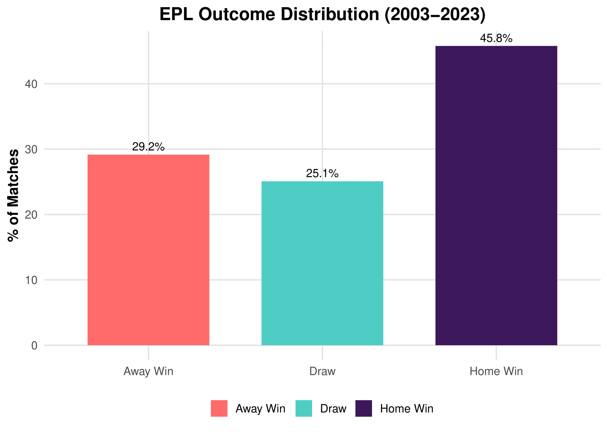
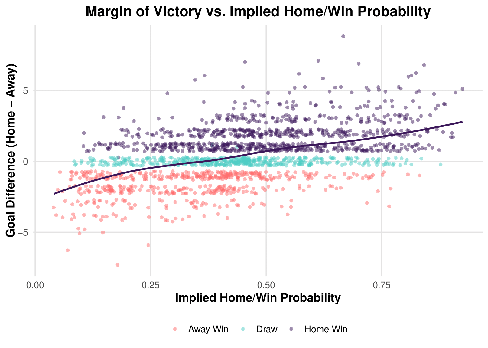
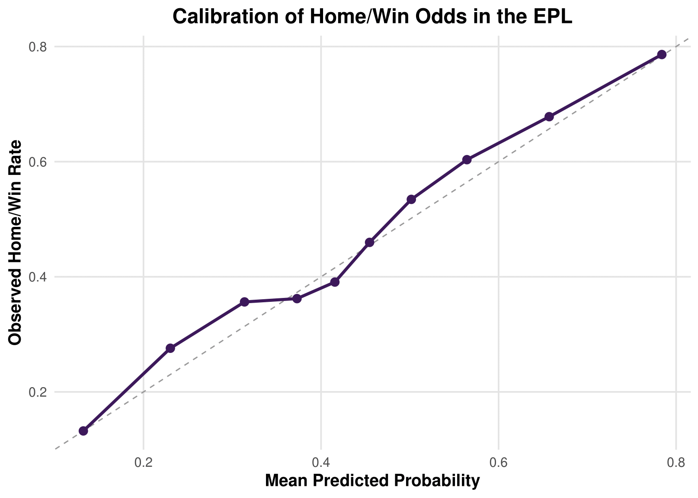
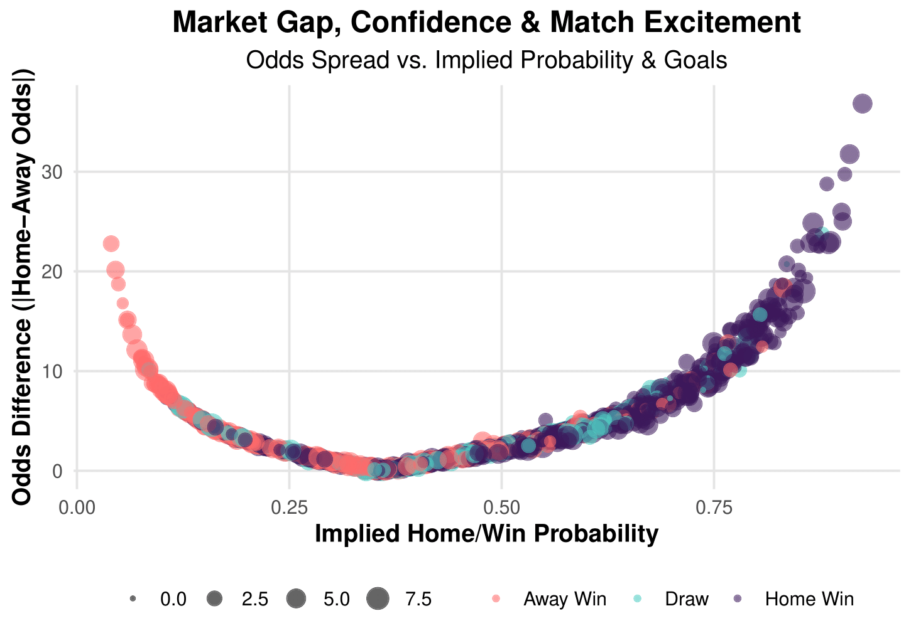
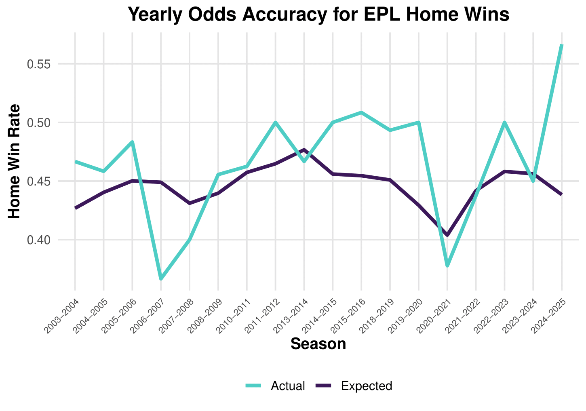

# Visualizations

This folder contains key visualizations generated from the Premier League
betting market analysis. Each plot highlights a different aspect of how
betting odds relate to actual match outcomes and market confidence.

---

## EPL Outcome Distribution

Distribution of match outcomes (home win, draw, away win) across EPL matches
from 2003–2023.

---

## Implied Home Win Probability by Outcome

Density of implied home-win probabilities separated by actual match outcome,
illustrating how market expectations differ by result.

---

## Calibration of Home Win Probabilities

Calibration plot comparing predicted home-win probabilities with observed
home-win rates to assess betting market accuracy.

---

## Market Confidence and Odds Gaps

Scatter plot showing the relationship between implied home-win probability and
the odds gap between teams, highlighting levels of market confidence.

---

## Expected vs Actual Home Win Rate by Season

Comparison of expected versus actual EPL home-win rates across seasons,
showing trends and deviations in market performance over time.
